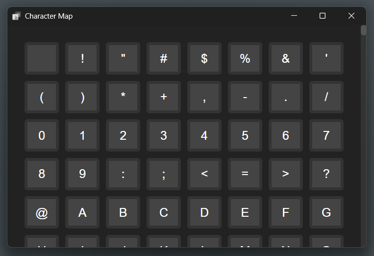

# Character-Map
A new simple way of getting characters!

**Character Map** is a windows application & a more simple way to get characters.

## Requirements
* Windows 10+
* Compatibity with x64
* 8.78 MB of available storage
* 3.2 MB of memory

## Features & Drawbacks
Features:
* Simple design
* Dark Mode
* Animations
* Good for the eyes
* 13311 different characters

Drawbacks:
* Little slow loading speed
* No white mode so expect a compatibility issue for light mode on it.

## Download
[Installation](https://github.com/mrjokester0101/Character-Map/raw/refs/heads/main/install.msi)
[Portable Edition](https://github.com/mrjokester0101/Character-Map/raw/refs/heads/main/CharacterMap.exe)

> [!NOTE]
> I'm just enjoying learning more about scripting/programming and learning as I go. 
> I'm a person who enjoys working alone so don't take it personally if i don't accept pull requests.

## Community

